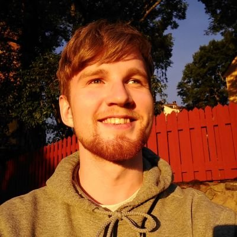

# Greetings!

My name is Noel Toivio and I specialize in Game Design, but I love to get involved in all parts of development. Games are made together after all!

**Career Summary**
- 2 released commercial games
- 5+ years of professional experience as a Designer
- 5 Years of Game Design education

# Examples of my work ⬇️

## Trailmakers 2.0 - Pioneers

<video muted="" autoplay="" controls="" loop="" height="320px" style="max-width:100%;">
    <source src="TrailmakersPioneers_Trailer.mp4" type="video/mp4">
</video>

Released on Steam, Playstation 4, Playstation 5, Xbox One and Xbox Series S/X

### Main Design Responsibilites
Combat Design
- Boss Design 1, 2 & 3
- All new enemy types
- New weapons

Onboarding and FTUE
- Beginner Tutorial
- New feature introductions

## Rubber Bandits

<video muted="" autoplay="" controls="" loop="" height="320px" style="max-width:100%;">
    <source src="RubberBandits_Trailer.mp4" type="video/mp4">
</video>

Released on Steam, Playstation 4, Xbox One, Xbox Series S/X and Nintendo Switch

### What I designed on the project
- Weapons and Items
- Game Modes
- Gameplay Modifiers
- Level Design
- Player Progression and Item Unlock System
- Store UX Design

<a href="https://github.com/pages-themes/minimal" class="btn">Read More</a>

<video muted="" autoplay="" controls="" loop="" height="320px" style="max-width:100%;">
    <source src="sumoball_action.mp4" type="video/mp4">
</video>

[Sumo Ball](sumo_ball.md)

when I was a kid I believed being a game developer meant scratching game discs by hand all day. And I still wanted to become one.
My idea of making games has changed a lot since then, but my passion stays the same.
