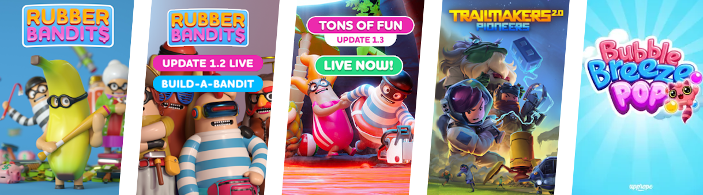

# Greetings, traveler!

My name is Noel Toivio and I specialize in <b>Game Design</b>.
My strengths lie in being able to vividly visualize problems and opportunities, communicate them clearly and being rational about what is achievable. My favorite feeling is when the whole team gets involved in making all our individual dreams come true to lift up the product as a whole.

**Career Summary**

🎉 3 released commercial games

👴 5+ years of professional experience as a designer

🎓 5 Years of game design education

[Resumé/CV](NoelToivio_CV.pdf) | [LinkedIn](https://www.linkedin.com/in/noel-toivio/) | [noel@toivio.se](mailto:noel@toivio.se)

 
 

  

 
 

# Examples of my work

## Trailmakers 2.0 - Pioneers

<video muted="" autoplay="" controls="" loop="" height="360px" style="max-width:100%;">
    <source src="TrailmakersPioneers_Trailer.mp4" type="video/mp4">
</video>

> <b>Released:</b> March 2025  
> <b>Platforms:</b> Steam, Playstation 4, Playstation 5, Xbox One and Xbox Series S/X

Areas of responsibility:
- <b>Design responsible for combat</b> which meant spearheading and setting the quality of the engaging boss designs, enemies and new weapons
- <b>Design responsible for onboarding and first time user experience</b> which meant designing the tutorial and well-paced feature introductions, fixing one of the main problems with Trailmakers—high player drop rates early on.
- <b>Overseeing open world gameplay interactions</b> where I mentored designers and set the quality of physics puzzles, character interactions and enemy camps.

<a href="trailmakers.html" class="btn">More info ↗</a>

## Rubber Bandits

<video muted="" autoplay="" controls="" loop="" height="360px" style="max-width:100%;">
    <source src="RubberBandits_Trailer.mp4" type="video/mp4">
</video>

> <b>Released:</b> December 2021  
> <b>Platforms:</b> Steam, Playstation 4, Xbox One, Xbox Series S/X and Nintendo Switch

I was the only designer on this project for over a year, working directly under the Creative Director which meant designing all parts of the game with the vision in mind.

I refined player controls, designed player abilities, weapons and items, game modes, gameplay modifiers, levels, the player progression system and the in-game shop UX design.

<a href="rubberbandits.html" class="btn">View player progression sheet ↗</a>

## Bubble Breeze Pop
<video muted="" autoplay="" controls="" loop="" height="500px" style="max-width:100%;">
    <source src="BubbleBreezePop_Trailer.mp4" type="video/mp4">
</video>

> <b>Released:</b> March 2018  
> <b>Platforms:</b> iOS and Android

I made over 150 levels as the level designer and was part of designing player power-ups and abilities.

 

# Solo Projects

## Escaping Death (WIP Name)

<video muted="" autoplay="" controls="" loop="" height="360px" style="max-width:100%;">
    <source src="TrailerEscapeDeath_v0.5.mp4" type="video/mp4">
</video>

> This free-time project is currently in development  
> I aim to release on Steam by the end of 2025, but let's see :)

In this roguelite without enemies, I am exploring the similarities between gaining player abilities and learning real-life skills. It has a mental health theme, which is a touchy subject but one I deeply care about.

- Developed in Unreal 5 by me using blueprint scripting

<a href="escapedeath.html" class="btn">More info ↗</a>

## Sumo Ball
<video muted="" autoplay="" controls="" loop="" height="360px" style="max-width:100%;">
    <source src="sumoball_action.mp4" type="video/mp4">
</video>

> Developed 2020

Sumo Ball is one of my student portfolio pieces from my time at The Game Assembly back in 2020. It's all made by me in Unreal using Blueprint scripting. The quality of my work has improved since then but by all means — feel free to take a look!

<a href="sumo_ball.html" class="btn">Design thought process ↗</a>