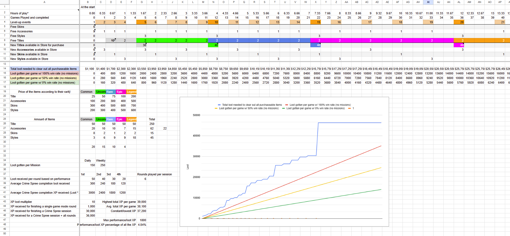

# Rubber Bandits

{:target="_blank"}

<video muted="" autoplay="" controls="" loop="" height="360px" style="max-width:100%;">
    <source src="RubberBandits_Trailer.mp4" type="video/mp4">
</video>

I wore many hats as a designer on this project, here are some more info about what I did:

- Worked on over 50% of the released levels
- Designed gameplay features from paper design, to final polished release and documented along the whole process
- Got comfortable with network code as I scripted multiple prototypes in C#
- Designed new gamemodes and gameplay modifiers, including UI mockup design
- Designed the shop layout and how reward types like cosmetics, titles and gameplay features should work, and when they should unlock

***

## Level design timelapse

I took some pictures of the level design process of one of the maps made for the Lunar Event, though some pictures of the start and end process are missing.

<blockquote class="twitter-tweet" data-media-max-width="560">
The 1st and 3rd person levels for <a href="https://twitter.com/hashtag/Blocktober?src=hash&amp;ref_src=twsrc%5Etfw">#Blocktober</a> looks great, but how about a top-down party brawler level for a change? It was made for <a href="https://twitter.com/ThatBanditsGame?ref_src=twsrc%5Etfw">@ThatBanditsGame</a> for the Lunar New Year event! Some pictures of the start and end process are missing but I&#39;m learning 🙈<a href="https://twitter.com/hashtag/LevelDesign?src=hash&amp;ref_src=twsrc%5Etfw">#LevelDesign</a> <a href="https://twitter.com/hashtag/GameDev?src=hash&amp;ref_src=twsrc%5Etfw">#GameDev</a> <a href="https://t.co/2IWFckB4Hi">pic.twitter.com/2IWFckB4Hi</a>
&mdash; Noel Toivio (@NoelToivio) <a href="https://twitter.com/NoelToivio/status/1582370855908438017?ref_src=twsrc%5Etfw">October 18, 2022</a></blockquote> 

Unique gameplay element:
- Hitting the drum in the middle makes spikes pop out from the ground! I scripted a working prototype of the feature to test and iterate on.

***

## Player progression sheet showcase

For my own sake as owner of the progression system I made use of my scripting skills within Google Sheets to get a better idea of what I wanted to achieve. Based on the values put into the system I generated graphs and calculations to better visualize my thoughts.

> This graph helped me understand and communicate with the team about many things about the reward system, like when to unlock items, how long it takes to unlock everything and how to balance prices and overall economy

<i>Right-click and press "Open image in new tab" to get a closer look</i>